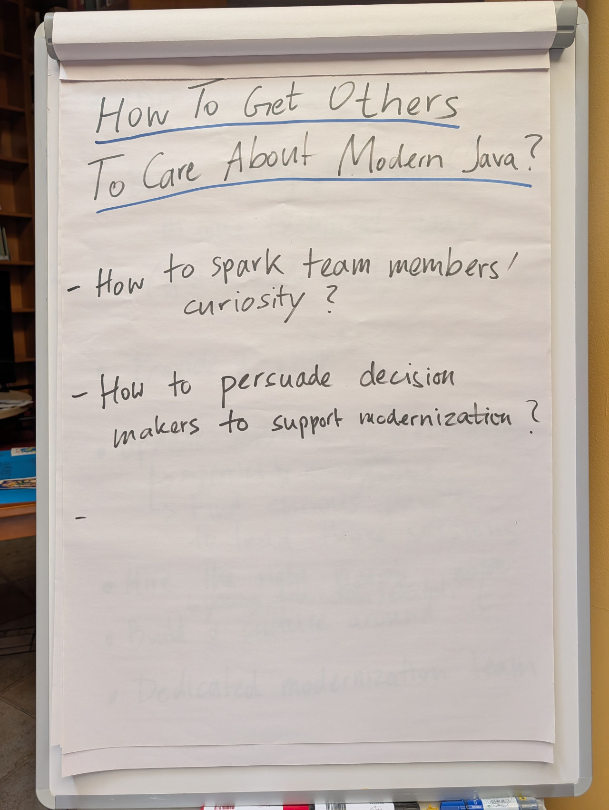
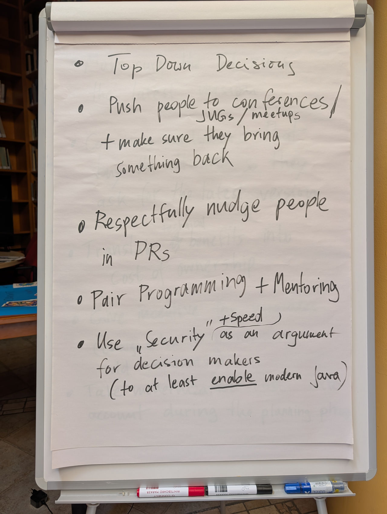
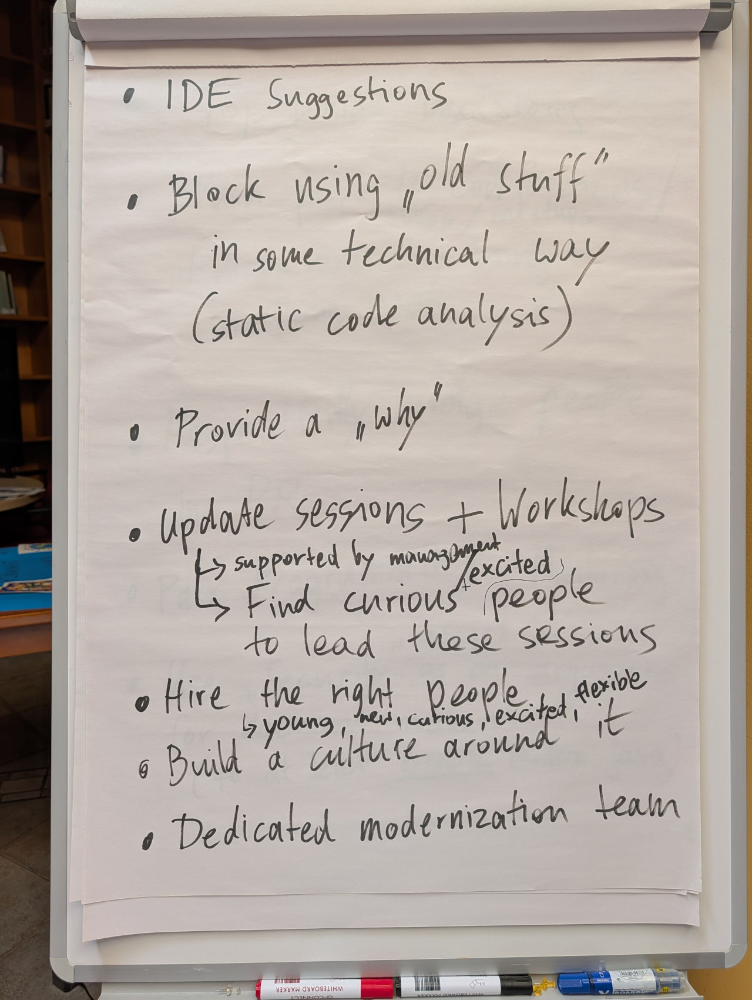
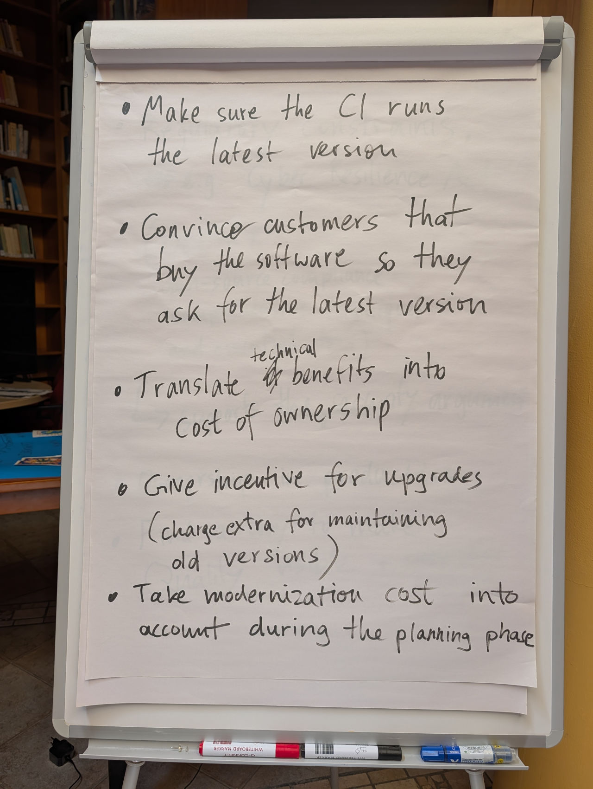
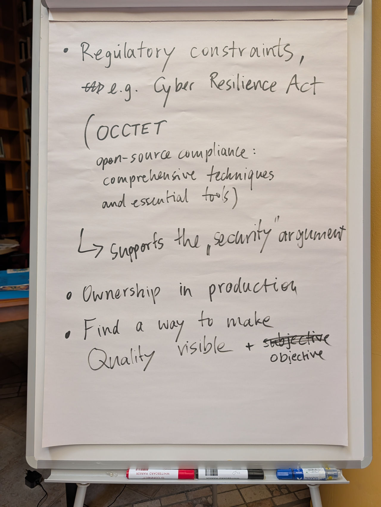

# How To Get Others To Care About Modern Java?

*JCrete 2026 – unconference session outcomes*

The ideas the room collected, grouped by the two questions we discussed – plus the
levers that cut across both.

---

## The questions we tackled

Being the person who *cares* about modern Java – who keeps up with new versions
and features while the rest of the team sits on an old LTS – is a lonely spot.
The session split the challenge into two audiences:

1. **How to spark team members’ curiosity?** (the people you work with)
2. **How to persuade decision makers to support modernization?** (the people who
   control budget and direction)

The room also surfaced a set of structural levers that cut across both – grouped
separately at the end.

---

## 1. Sparking team members’ curiosity

- **Provide a “why”.** Never push a change without the reasoning behind it.
- **Push people to conferences, JUGs & meetups – and make sure they bring
  something back.** Attendance only pays off if the learnings return to the team.
- **Pair programming + mentoring.** Modern idioms spread fastest hands-on.
- **Respectfully nudge people in PRs.** Code review as a low-friction teaching
  moment.
- **Update sessions & workshops.** Backed by management – and led by the curious,
  excited people on the team, not forced on the reluctant.
- **IDE suggestions.** Let the tooling surface modern alternatives as people type.
- **Build a culture around it.** Make “staying current” a shared value, not a
  one-off campaign.

## 2. Persuading decision makers

- **Use “Security” (and speed) as the argument.** For decision makers, security
  is the lever – at minimum to *enable* modern Java (i.e. run on a current
  runtime).
- **Lean on regulatory constraints.** e.g. the EU
  [Cyber Resilience Act](https://en.wikipedia.org/wiki/Cyber_Resilience_Act) – it
  strengthens the security argument. _(Room reference:
  [OCCTET](https://occtet.eu/) – open-source compliance: comprehensive techniques
  and essential tools.)_
- **Translate technical benefits into cost of ownership.** Speak the language of
  budgets, not JEPs.
- **Give an incentive for upgrades.** e.g. charge extra for maintaining old
  versions.
- **Take modernization cost into account during the planning phase.** Budget for
  it upfront instead of letting it pile up as debt.
- **Convince the customers who buy the software** so they start asking for the
  latest version themselves – pull instead of push.
- **Make quality visible and objective.** Find a way to measure it, so the case
  for modernization stops being a matter of taste.

## 3. Cross-cutting levers – make modern the default

- **Top-down decisions.** Sometimes leadership simply setting the standard is the
  fastest path.
- **Block using “old stuff” technically** – e.g. static code analysis that flags
  or forbids outdated constructs.
- **Make sure the CI runs the latest version.** The pipeline enforces what
  conversations can’t.
- **Ownership in production.** “You build it, you run it” creates a natural pull
  toward keeping things current.
- **Hire the right people** – young, new, curious, excited, flexible.
- **Dedicated modernization team.** A group that owns the effort instead of
  hoping it happens on the side.

---

## Raw flip-chart photos

The original notes from the room, in the order they were written:

